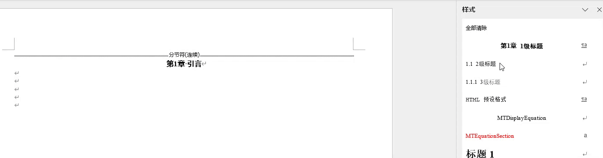
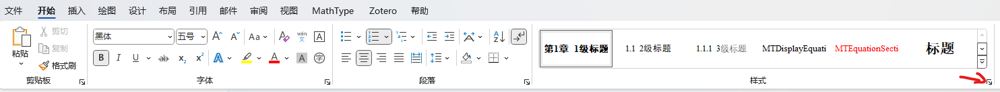
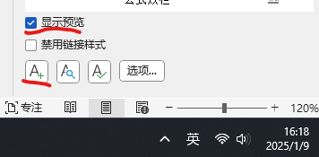
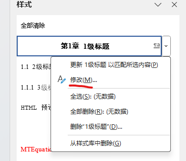
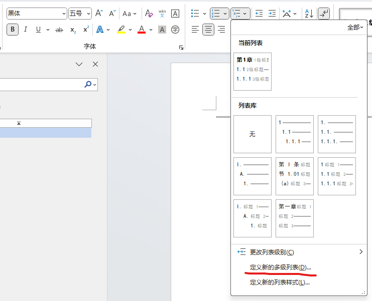
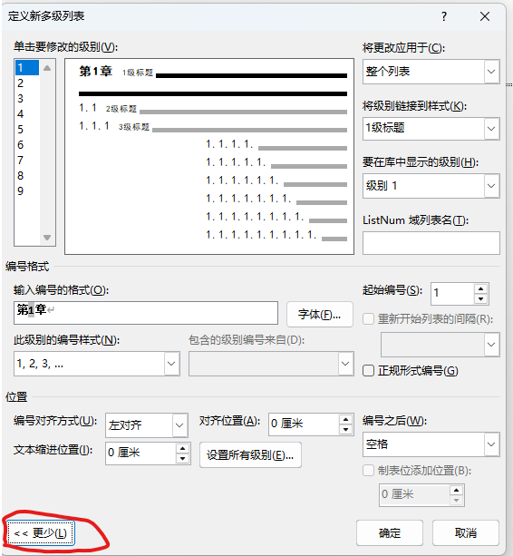

|软件| 版本 |
|---|---|
|  office365 | 2411  |

## 前言 💡
使用word排版论文主要有两大要点，多级标题和多级列表。前者可以自动生成目录，后者可以自动添加标号，决定了图片、公式、表格的序号。本文从最基础的样式开始图文教程。效果展示：

## 样式 
样式可以理解为一套模板，有了这个模板，你将专注于写作而无需担心格式问题。同时如果后期需要修改格式，只需要修改样式，所有内容将会自动调整。
1. 使用word的样式功能，点击 开始→样式角标：

2. 新建样式，在word屏幕左下角勾选“预览”，点击 A+

3. 样式由属性和格式组成，需要配置的选项很多，以下为经常用到的配置：

|样式属性|配置说明|
|---|---|
| 名称 |  给样式起名 |
| 样式类型 | 一般选择段落 |
| 样式基准 |  基于某个样式，可以基于一个模板样式 |
| 后续样式 | 该样式结束后的样式，一般选择正文 |

|样式格式|配置说明|
|---|---|
| 字体 |  需要配置中文字体、西文字体、字形和字号 |
| 段落 | 此配置非常重要，涉及目录和序号生成 |

💡 在段落-缩进与间距，你可以配置大纲级别、行距、首行缩进、段前段后缩进。在样式-段落-中文版式中可以设置换行规则和文本对齐方式

4. 修改已有样式：如果第一次没配置好或需要更改格式，可以选择对应样式→右键→修改
    

## 多级列表
仅有样式还不能完全解放双手，通过定义多级列表自动标号。
1. 在段落栏选择多级列表-定义新的多级列表:
    

2. 展开更多配置:
    关键配置：编号格式、编号位置、将级别链接到样式
    

