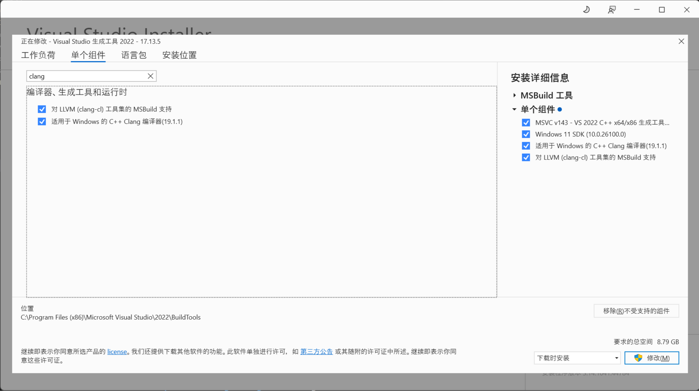

# 编译
C/C++三大编译器分别为GCC(GNU Compiler Collection)、Clang、MSVC，其中GCC、Clang是跨平台的。下面将分别介绍Windows和Linux的C/C++开发环境。

## Windows
Windows下C/C++开发首选MSVC，[GCC和Clang](https://winlibs.com/)可能会发生错误，因为MSVC与GCC的编译规则不同。也可以使用基于MSVC的Clang。

1. 下载[Visual Studio 2022 生成工具](https://aka.ms/vs/17/release/vs_BuildTools.exe)，而非Visual Studio

2. 选择单个组件，如图所示：


## Linux

不同Linux系统安装方式不同，以Ubuntu为例：
```sh
# GCC
sudo apt install gcc g++

# Clang
sudo apt install clang clang-tools
```