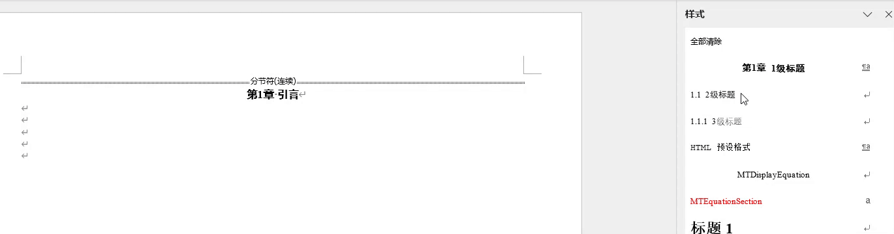
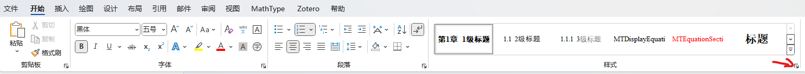
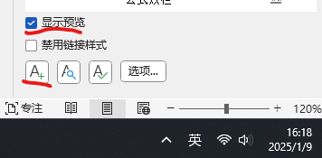
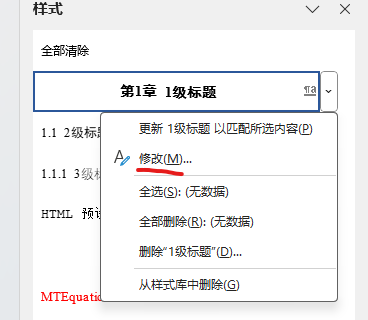
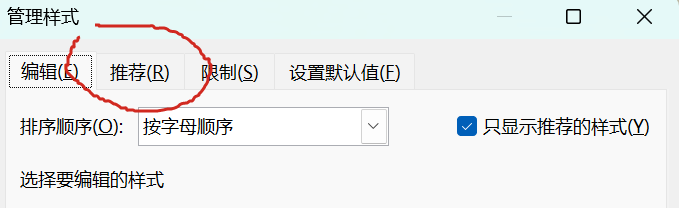
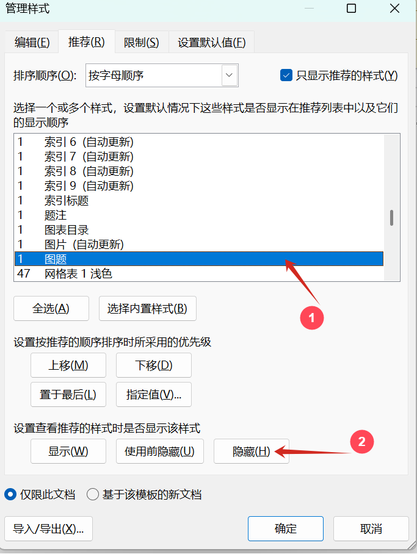
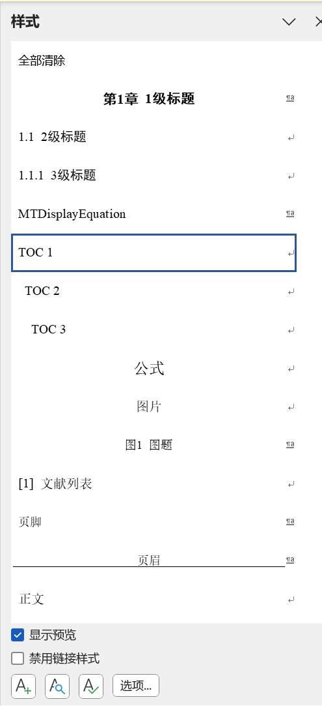
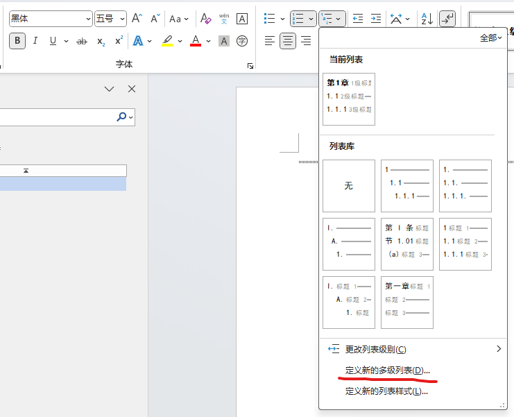
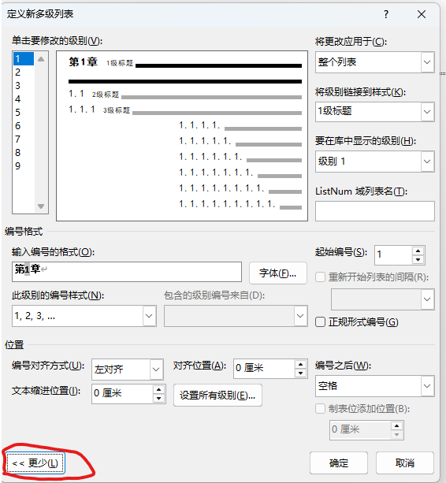

# Office
Office，我只想说懂得都懂，不懂的我也不多说了，说了你也不明白，不如不说，细细品吧，你也别来问我怎么回事，这里面利益牵扯太大了，说了对你我都没有好处，你就当不知道就行了，其余的我只能说这里水很深，牵扯到很多东西，详细情况你们很难找到的，网上大部分都删干净了。

## 前提条件
已安装[scoop包管理器](./包管理器.md)

## 安装
由于office组件很多，建议安装office-tool-plus管理：
```sh title="PowerShell"
scoop install scoop-cn/office-tool-plus
```

## 一、Word
使用word排版的两大要点：多级标题和多级列表。前者可以自动生成目录，后者可以自动添加标号，决定了图片、公式、表格的序号。效果展示：


### 样式 
样式可以理解为一套模板，有了这个模板，你将专注于写作而无需担心格式问题。同时如果后期需要修改格式，只需要修改样式，所有内容将会自动调整。
1. 使用word的样式功能，点击 开始→样式角标：
    

2. 新建样式，在word屏幕左下角勾选“预览”，点击 A+：

    

3. 样式由属性和格式组成，需要配置的选项很多，以下为经常用到的配置：

    |样式属性|配置说明|
    |---|---|
    | 名称 |  给样式起名 |
    | 样式类型 | 一般选择段落 |
    | 样式基准 |  基于某个样式，可以基于一个模板样式 |
    | 后续样式 | 该样式结束后的样式，一般选择正文 |

    |样式格式|配置说明|
    |---|---|
    | 字体 |  需要配置中文字体、西文字体、字形和字号 |
    | 段落 | 核心配置，涉及目录和序号生成 |

    💡 在段落-缩进与间距，你可以配置大纲级别、行距、首行缩进、段前段后缩进。在样式-段落-中文版式中可以设置换行规则和文本对齐方式

4. 修改已有样式：如果第一次没配置好或需要更改格式，可以选择对应样式→右键→修改
    

### 隐藏多余样式
通常word会自动在样式列表显示很多无用的样式，可以通过隐藏这些样式来减少样式列表的干扰。
1. **首先点击管理样式：**

2. **选择管理样式栏：**

3. **选择不需要的样式，点击隐藏：**

4. **最终只显示需要的样式：**

### 多级列表
仅有样式还不能完全解放双手，通过定义多级列表自动标号。
1. 在段落栏选择多级列表-定义新的多级列表:
    

2. 展开更多配置:
    关键配置：编号格式、编号位置、将级别链接到样式
    

### 公式编辑
1. **方案对比**
    | **对比** | office(latex)  | MathType | AxMath  |
    |---|---|---|---|
    | **清晰度** | ⭐⭐⭐ |  ⭐⭐ |  ⭐ |
    | **兼容性** | ⭐⭐⭐ |  ⭐ |  ⭐ |
    | **编辑效率** | ⭐⭐⭐ |  ⭐⭐⭐ |  ⭐⭐⭐ |
    | **功能** | ⭐⭐ |  ⭐⭐⭐ |  ⭐⭐⭐ |
    | **性能** | ⭐⭐⭐ |  🥵 |  ⭐⭐⭐ |
    | **价格** | ⭐⭐⭐ |  🥵 |  ⭐ |
    | **AI解析** | ⭐⭐⭐ |  🥵 |  🥵 |
    
    综上，使用office直接编辑公式有着巨大优势，AI能直接解析latex并理解，懂的都懂。下面进行office math配置。
2. **配置office(latex)**
    - 下载[Latin Modern Math字体](https://www.gust.org.pl/projects/e-foundry/lm-math/download)
    - 新建字体样式：
    - 新建段落样式：
    - 最终实现美观的latex公式，并且支持自动编号：
<!--  -->